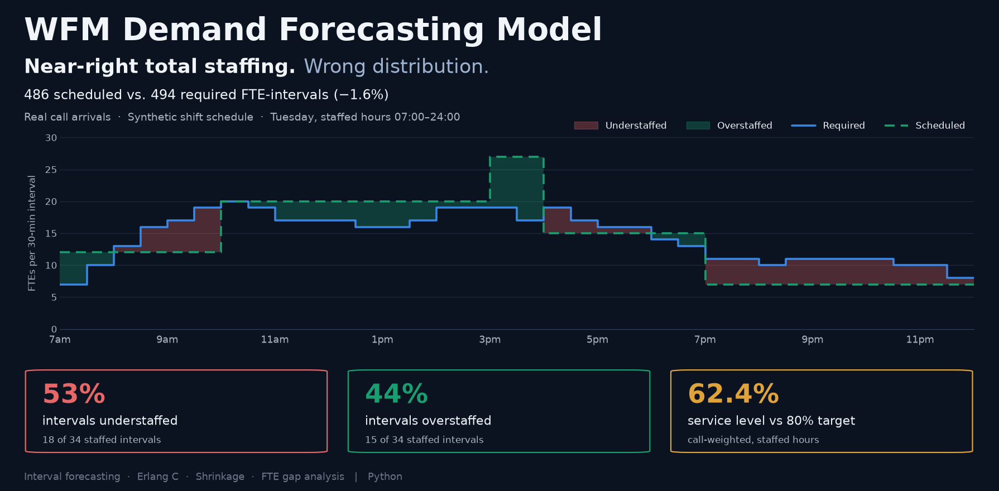
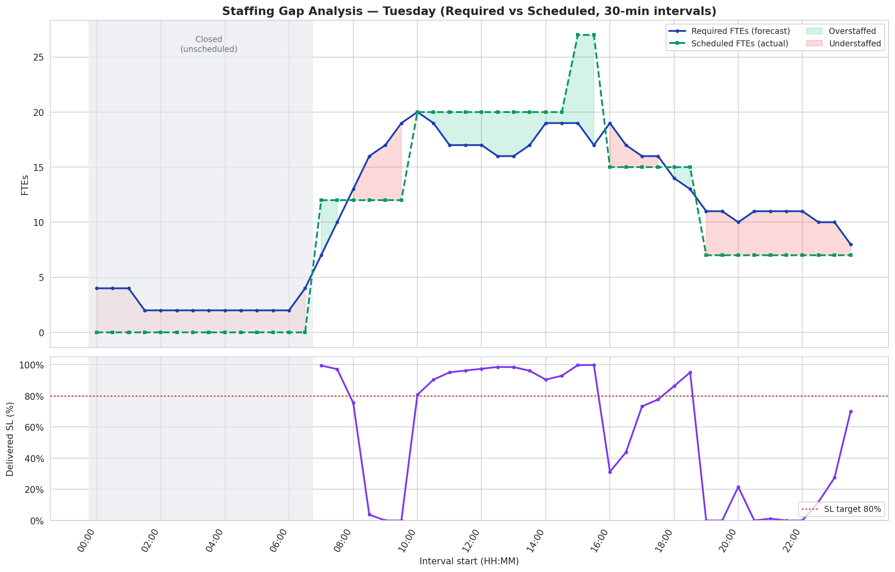
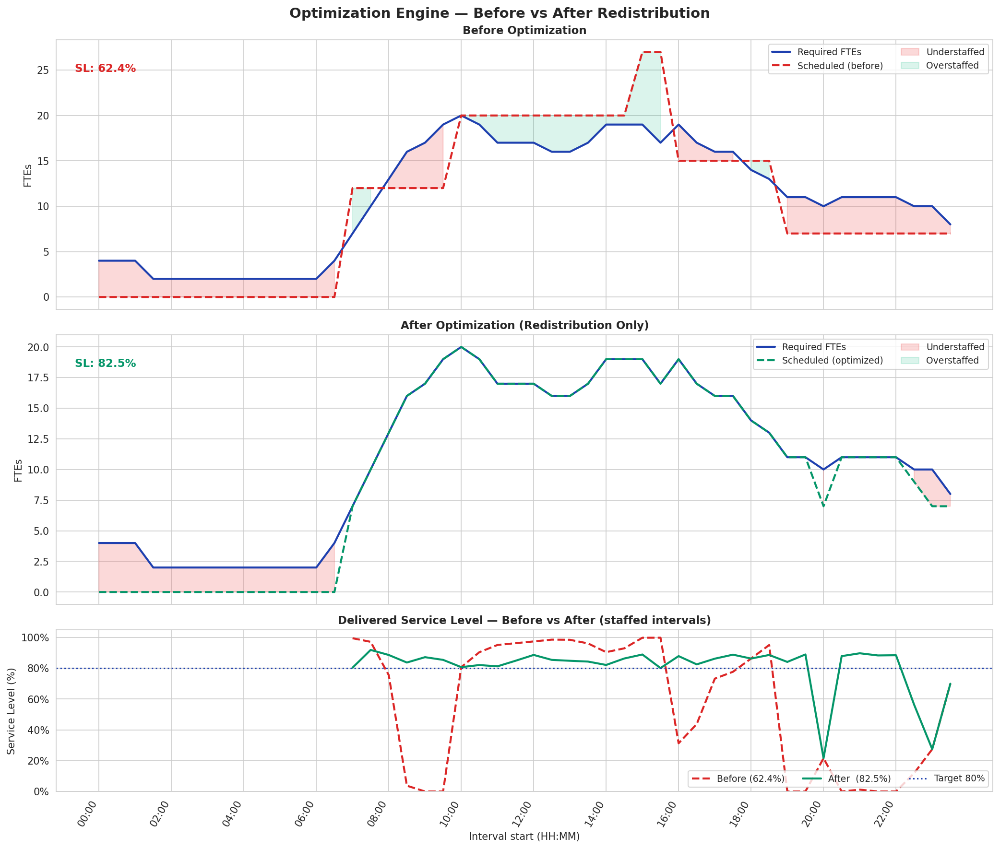

# WFM Demand Forecasting Model



Interval-level intraday call volume forecasting, shrinkage modeling, Erlang C 
service-level estimation, and FTE gap analysis to support contact-center 
staffing optimization.

## What this project shows

A schedule can be within 2% of its staffing requirement during staffed hours and still
miss service level badly, because the hours are in the wrong intervals.

Forecasting real 1999 bank call-center arrivals and sizing each 30-minute
interval with Erlang C, a typical three-shift schedule covering 07:00–24:00
came to **486 scheduled FTE-intervals against a requirement of 494 (−1.6%)**.
Interval by interval, **18 of 34 staffed intervals were understaffed (53%)
and 15 overstaffed (44%)**, and delivered service level was **62.4%** against
an 80/20 target.

Moving the surplus hours into the short intervals — **no hours added** —
raised service level to **82.5% (+20.2 percentage points)**. A 10% headcount
increase raised it to 76.9% (+14.5 pp).

**What is real and what is modeled.** The call arrivals are real. The
schedule is synthetic: three shift blocks built to be roughly right in total
but deliberately *not* matched to the demand curve, which is the common
failure mode interval analysis exists to catch. This is a demonstration of the
method, not a measurement of a real center's schedule. The same schedule
applied to each weekday's demand profile gives the same picture (41–53% of
intervals understaffed, total within 3%, service level 59–66%), so the result
is not specific to the one day shown.



**Method:** profile-ratio interval forecast (**21.2% WAPE** on a 20-workday
holdout) → Erlang C sizing to 80/20 under a 90% occupancy ceiling → 34%
shrinkage build-up → interval-by-interval gap report → redistribution and
lever comparison.

---


---

## What it demonstrates

- **Interval-level volume forecasting** — a transparent profile-ratio (percent-of-day) forecast that separates the day-total expectation from the intraday distribution, validated on a holdout and reported with **WAPE** (the volume-weighted error metric WFM teams track), not just MAPE.
- **Workload conversion** — calls × Average Handle Time → offered load (Erlangs).
- **Erlang C service-level modeling** — sizing agents-on-phone to an 80/20 service-level target under a 90% occupancy ceiling, with the queueing assumptions and their real-world caveats stated plainly.
- **Shrinkage modeling** — a fully decomposed shrinkage build-up (breaks, training, coaching, PTO, unproductive time) uplifting the on-phone requirement to scheduled FTEs.
- **Staffing gap analysis** — required vs. a synthetic lumpy shift schedule, interval by interval, surfacing over/under-staffed intervals and the delivered service level — demonstrating how total headcount can be right while the intraday distribution is wrong.
- **Redistribution (Module 5)** — moves surplus agent-intervals into short intervals, holding the total constant, and recomputes delivered service level.
- **Lever comparison (Module 6)** — redistribution vs. headcount, AHT and shrinkage levers, reported in percentage points.
- **Multichannel methodology (Section 9)** — chat with concurrency and email as a backlog model, on illustrative assumptions.

## The data

**"Anonymous Bank" call-center dataset** — Service Enterprise Engineering (SEE) Lab, Technion – Israel Institute of Technology (Prof. Avi Mandelbaum); documented by Guedj & Mandelbaum (2000) and widely used in the call-center / queueing literature (Brown et al., 2005).

Accessed via the `Rfssa` package data mirror, which publishes the 1999 arrivals pre-aggregated into **6-minute intervals** (240 intervals/day × 365 days = 87,600 rows):

```
https://github.com/haghbinh/dataset/raw/main/Rfssa_dataset/Callcenter.rds
```

A copy (`Callcenter.rds`) is included in this repository; the notebook uses it, and downloads it only if it is missing.

## Methodology, not platform

My WFM experience is founder-era (a 350-agent call center, intraday management, service-level/abandonment SLAs, schedule adherence and shrinkage reporting) and predates the modern commercial suites (NICE, Verint, Calabrio). Those tools automate exactly the methodology shown here: interval forecasting, Erlang queueing, shrinkage uplift, and schedule-vs-requirement gap analysis. This project demonstrates that underlying methodology directly in Python — the reasoning that sits beneath any platform.

## Provenance & honesty notes

- The **arrival data is real**; the **WFM overlay is synthetic and labeled as such** throughout the notebook
- — Average Handle Time (240s), the 34% shrinkage build-up, the 80/20 service-level target, the 90% occupancy ceiling, and the shift schedule are explicit planning assumptions, not values derived from the data.
- **Business logic, WFM domain framing, and operational assumptions are my own**, drawn from contact-center workforce-management experience. AI tooling assisted with Python syntax and plotting code.

## Results

All service-level changes are percentage points (pp) against the 62.4% baseline, Tuesday profile, staffed hours 07:00–24:00.

| Scenario | Scheduled FTE-intervals | Service level | Change |
|---|---:|---:|---:|
| Baseline schedule | 486 | 62.4% | — |
| Redistribute existing hours | 486 | 82.5% | **+20.2 pp** |
| Add 10% headcount | 534 | 76.9% | +14.5 pp |
| Reduce AHT 15% | 486 | 76.2% | +13.8 pp |
| Reduce shrinkage 4 points | 486 | 69.3% | +6.9 pp |
| Add 5 FTEs in every interval (+35% hours) | 656 | 95.5% | +33.1 pp |
| Redistribute + AHT + shrinkage | 486 | 94.4% | +32.0 pp |

Redistribution beats a comparable 10% headcount add here because this schedule's problem is placement. It is not a general rule: a large enough headcount add beats it, and on flat demand redistribution has nothing to move (see the [WFM Decision Lab](https://github.com/SEANSKIDATA/WFM-Decision-Lab), which tests where it wins across 1,470 scenarios).



## Limitations

- **Synthetic schedule.** Built to show the failure mode, so the size of the gap reflects that construction.
- **Staffed hours only.** 00:00–07:00 is unscheduled (1.2% of the day's calls, 36 required FTE-intervals). Service level and the 2% comparison cover 07:00–24:00; across the full 24 hours the schedule is 8.3% short.
- **Redistribution moves agent-intervals freely** between half-hours. It shows the value of better placement, not a rosterable shift plan under labor rules.
- **Erlang C** assumes no abandonment, so intervals with fewer agents than offered load score 0% rather than modeling a queue that carries over.

## Verify

```bash
python tests/verify_published_numbers.py    # re-runs the notebook's code and checks every number above (19 checks)
```

## Stack

Python 3.9+ · pandas · NumPy · Matplotlib · Seaborn · `pyreadr` (to read the R `.rds` data) · Jupyter

## Run it

```bash
pip install -r requirements.txt
jupyter notebook WFM_Demand_Forecasting.ipynb
```

Or open the notebook on GitHub: every cell has been run top to bottom and its outputs are saved.

## Files

| file | purpose |
|---|---|
| `WFM_Demand_Forecasting.ipynb` | the full analysis, with outputs and charts |
| `Callcenter.rds` | the arrival data (SEE Lab, via the Rfssa mirror) |
| `tests/verify_published_numbers.py` | checks every published number against the notebook's code |
| `staffing_gap_chart.png`, `optimization_before_after.png`, `decision_lab_scenarios.png`, `multichannel_comparison.png` | charts written by the notebook |
| `CHANGELOG.md` | what changed and why |
| `requirements.txt` | Python dependencies |
| `README.md` | this file |

## Acknowledgement

Data source: SEE Lab, Technion (Prof. Avi Mandelbaum). The data is free for academic / non-commercial use; please acknowledge the source in any derived work.

## Extensions a production build would add

Abandonment-aware queueing (Erlang A/X), intraday re-forecasting, multi-skill / blended workload, shift-bidding optimization, and a what-if sensitivity layer for AHT and shrinkage.
